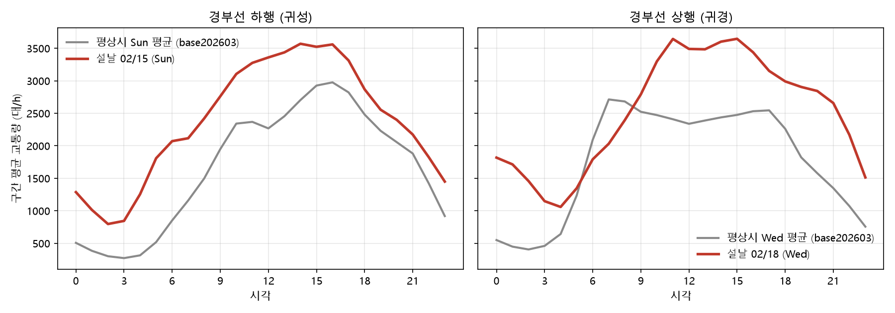

# T-07 / T-08 경부선 구간 교통량·속도 수집

## 1. 수집 대상 결정

### 1.1 포털 교통량 데이터셋 비교

고속도로 공공데이터 포털(data.ex.co.kr) "데이터조회 > 교통" 에서 확인한 것.

| 데이터셋 | 계열 | 단위 | 무엇을 세는가 | 우리 쓰임 |
|---|---|---|---|---|
| **구간교통량(VDS)** | VDS | 콘존(IC~IC 구간), 1시간 | 본선 단면을 지나간 대수 (전 차로 합) | **CTM 셀 유입량·EV 도착 프로파일** (채택) |
| **구간속도** | VDS | 콘존, 1시간 | 본선 평균 속도 | **CTM 보정·검증** (채택, T-08) |
| 영업소별 이용차량 | TCS | 영업소, 일·시간 | 요금소 입·출구 통과 대수 | "어디서 들어와 어디서 나가는가" 근거 (후속) |
| 영업소간 이용차량 / OD | TCS | 영업소 쌍 | 진입~진출 영업소 쌍별 대수 | OD 추정 (후속) |
| 권역별 이용차량 | TCS | 권역 | 권역 단위 합계 | 사용 안 함 |

- 셀 유입량(본선을 지나가는 차량)에는 **본선 단면 교통량(VDS)** 이 맞다.
  영업소(TCS) 교통량은 본선에 들어오고 나가는 양이라 단면 교통량과 단위가 다르다.
- 둘은 "단면 교통량 변화 = 그 사이 영업소 진입 − 진출" 로 교차검증할 수 있다.
  **이번에는 VDS 만 받았다.** TCS 교차검증은 후속 이슈로 둔다.
- 두 VDS 데이터셋은 같은 콘존 ID 체계를 써서, T-07 과 T-08 의 "같은 지점·같은 기간"이
  구조적으로 보장된다.

### 1.2 수집 방식

포털 화면의 CSV 버튼은 화면이 받은 JSON 을 브라우저에서 표로 바꾸는 것뿐이다
(서버 파일이 아니다). 그래서 화면이 부르는 엔드포인트를 직접 호출해 **JSON 을
원본으로 저장**한다. 인증키가 필요 없다.

| 용도 | 엔드포인트 (POST) | 주요 파라미터 |
|---|---|---|
| 콘존 목록 | `/portal/traffic/getTrafficConzone` | `lineNo=0010`, `direction=S|E` |
| 시간대별 교통량 | `/portal/traffic/getTrafficVds` | `conzoneId`, `searchDayFrom`, `searchDay`, `xAxis=time` |
| 일 교통량 합계 | 같은 엔드포인트 | `xAxis=day` (시간 합계 검증용) |
| 시간대별 속도 | `/portal/speed/getSpeedVDS` | 교통량과 같음 |

- 조회 창은 최대 30일. `fetch_traffic.py` 가 알아서 나눈다.
- 응답 `excelData` 한 행 = 한 시간(`preTime` 00~23), 열 = 날짜(`day_i`) × 값(`day_Cnt{i}`).

### 1.3 경부선 식별자

| 출처 | 표기 |
|---|---|
| 도로중심선 파일 | `ROAD_NO = 10` |
| 도로공사 OpenAPI (휴게소·IC 위치) | `routeNo = 0010` |
| 포털 구간 교통량·속도 | `lineNo = 0010`, 콘존 `0010CZ{S|E}nnn` |

방향 코드: **S = 서울→부산 = 하행(DOWN)**, **E = 부산→서울 = 상행(UP)**.
포털 방향 API 는 `startName=부산, endName=서울` 을 주지만 화면은 S 를 "서울→부산"
으로 쓴다. 이름만 보면 뒤집혀 보이니 주의. 콘존 목록 순서(S 는 한남IC 에서 시작)와
§4.2 의 귀성·귀경 방향 검사로 확인했다.

### 1.4 결측 코드

포털은 결측을 빈 값이 아니라 숫자로 준다. 실제 값이 아니므로 결측으로 바꾸고
원래 코드는 `missing_code` 열에 남긴다.

| 값 | 의미 (관찰) |
|---|---|
| 교통량 `-1` | 콘존·일자 단위로 24시간 통째로 나온다 (검지기 없음·장기 고장) |
| 교통량 `-2` | 시간 단위로 드문드문 (일시 장애) |
| 속도 `0` | 교통량 결측 시간과 거의 1:1 로 겹친다 (설 수집본 4,437 vs 4,433) |
| `-9` (우리가 붙임) | 포털 응답에 그 콘존 데이터가 아예 없음. 검지기 없는 짧은 구간 (판교JC~판교IC 등). 행을 빼면 결측률이 낮게 보고되어 격자를 채워 남긴다 |

그 외의 음수·과대 교통량(> 20,000 대/h), 0 이하·200 초과 속도는 파싱 단계에서 멈춘다.

## 2. 수집 기간

| 이름 | 기간 | 이유 |
|---|---|---|
| `seollal2026` | 2026-02-13(금) ~ 02-22(일) | 설 연휴 2/16~2/18 앞뒤 여유. 귀성·귀경 피크 모두 포함 |
| `base202603` | 2026-03-06(금) ~ 03-15(일) | 같은 계절 평상시. **요일 구성을 설 기간과 맞췄다** (금~일 10일). 삼일절 대체휴일(3/2) 주간은 피함 |
| `chuseok2026` | 2026-09-21(월) ~ 10-04(일) | **9/28 이후 수집** (아래 명령). 설날로 맞춘 모델의 홀드아웃 |

추석분 수집 명령 (10/5 이후면 전체 기간을 받을 수 있다):

```bash
python scripts/fetch_traffic.py --start 2026-09-21 --end 2026-10-04 --label chuseok2026
python scripts/build_traffic.py
```

## 3. 지점 위치 (offset_km)

콘존에는 좌표가 없다. 양 끝 IC 이름을 도로공사 전국 IC 목록 좌표에 붙이고,
T-06 과 같은 노선(`data/processed/gyeongbu_route.json`)에 투영해 이정을 구한다
(`evdt.io.route.GyeongbuRoute.offset_of` — T-09a 의 `offset_of()` 를 먼저 구현).

- 휴게소와 VDS 구간이 **같은 노선 파일** 을 쓴다. 폴리라인은 넣는 점 집합에 따라
  총연장이 1~2 km 달라져서, 각자 만들면 좌표계가 어긋난다.
- IC 목록의 중복(영천·김천·추풍령·구서·경주)은 콘존 체인 순서로 고르고,
  좌표가 없거나 순서를 거스르는 끝점(서울TG, 서울산IC, 옥산JC, 통도사 하이패스IC,
  다른 노선 소속 JC 등)은 앞뒤 끝점 사이를 선형 보간한다 (`position_source`).
- 코리도(양재IC~구서IC) 밖 콘존(한남~양재, 구서~시점)은 정리본에서 뺀다.

## 4. 결과 (T-07 교통량)

`python scripts/check_traffic.py --holiday seollal2026 --base base202603 --outbound 2026-02-14 2026-02-16 --return 2026-02-17 2026-02-18`

### 4.1 정리본

| 파일 | 행 | 비고 |
|---|---:|---|
| `traffic_gyeongbu.parquet` | 63,360 | 2기간 × 132콘존(방향별 66) × 10일 × 24시간. 코리도 안 콘존 전부 |
| `speed_gyeongbu.parquet` | 63,360 | 같은 키 |
| `conzone_gyeongbu.parquet` | 284 | 콘존 위치표. 코리도 안 132개 중 34개는 보간 위치 |

- 24시간이 다 있는 날은 **시간대 합계 == 포털 일 합계** 가 전부 일치했다.
- 교통량 0 인 시간은 없었다.

### 4.2 설날 / 평상시 일교통량 (같은 요일끼리, 구간 평균)

두 기간 모두 결측 10% 이하인 **113개 콘존**만 평균한다. 검지기가 빠진 콘존이
기간마다 달라서(설 8개, 3월 17개) 전부 쓰면 다른 콘존 집합끼리 비교하게 된다.

| 날짜 | 요일 | 하행 비율 | 상행 비율 | |
|---|---|---:|---:|---|
| 02-13 | 금 | 1.18 | 1.05 | |
| 02-14 | 토 | 1.26 | 0.97 | 귀성 |
| **02-15** | 일 | **1.43** | 1.09 | **귀성 피크** |
| 02-16 | 월 | 1.18 | 1.16 | 설 전날 (양방향 모두 많다) |
| 02-17 | 화 | 1.27 | 1.42 | 설 당일 |
| **02-18** | 수 | 1.04 | **1.43** | **귀경 피크** |
| 02-19 | 목 | 0.99 | 1.11 | |
| 02-20~22 | 금~일 | 0.97~1.02 | 0.99~1.04 | 평상시 수준 |

- 귀성 기간은 하행 > 상행, 귀경 기간은 상행 > 하행 → **방향 매핑 확인됨** (S=하행).
- 피크일 교통량은 같은 요일 평상시의 약 1.4배.
- 설 당일(2/17)은 하행도 1.27배로, 귀성·귀경이 겹친다.

### 4.3 시간대 곡선



- 새벽 2~4시 골, 11~16시 피크. 평상시 수요일 상행은 7시 출근 피크가 있지만,
  귀경일은 그 피크가 사라지고 **11~15시 고원** 이 된다. 이 모양 차이가
  "명절은 특정 시간대로 몰린다" 의 근거다.
- 새벽 교통량이 평상시의 약 1.7~3배다 (이른 출발).

### 4.4 결측

| 기간 | 하행 | 상행 |
|---|---:|---:|
| 설날 | 13.8% | 14.2% |
| 평상시 | 13.8% | 13.9% |

(코리도 안 콘존 × 전 시간 기준. 결측 코드별 비중은 `missing_code` 로 볼 수 있다.)

- 결측은 크게 두 종류다.
  1. **콘존 통째로 없음** — 포털이 데이터를 주지 않는 콘존 (`-9`, 설 8개·3월 17개)과
     하루 24시간이 모두 `-1` 인 콘존·일자. **결측 8,825시간 중 8,496시간(96%)**.
  2. **시간 단위 드문드문** (`-2`) — 나머지 4%.
- **처리 방침: 정리본에는 결측을 NaN 으로 남긴다.**
  - 콘존 통째 결측은 보간하지 않는다. 쓰는 쪽(T-12 도착 프로파일, CTM 보정)은
    결측 없는 인접 콘존 값을 쓴다. 경부선 콘존 간격이 수 km 라 인접 콘존이 대표할 수 있다.
  - 드문드문 결측(`-2`)은 필요하면 앞뒤 시간 선형 보간.

## 5. 결과 (T-08 속도·파라미터)

### 5.1 교통량·속도 짝

63,360시간 중 둘 다 있음 54,523 / 둘 다 결측 8,825 / **한쪽만 12시간 (콘존 5개)**.
결측은 교통량·속도가 거의 항상 함께 빠진다.

### 5.2 파라미터 실측 (`config/flow_params.yaml`)

| 파라미터 | 가정값 | 실측 | 출처 |
|---|---:|---:|---|
| v_free (km/h) | 100 | 하행 **96.4** (IQR 94.1~99.6) / 상행 **98.1** (94.2~101.3) | measured |
| q_max 병목 용량 (대/h/구간) | 2,200/차로 | 하행 중앙값 **4,000** (16콘존) / 상행 **4,249** (21콘존) | measured |
| q p95 시간교통량 (대/h/구간) | — | 하행 3,334 / 상행 3,313 (용량 하한) | measured |
| k_jam (대/km/차로) | 144 | — | assumed (끝까지) |
| w_back (km/h) | 20 | — | assumed (T-09 이후 역산) |

**티켓의 q_max 방법(p95)은 용량이 아니었다.** p95 를 4차로로 나누면 차로당
830대/h, 이걸로 w_back 을 역산하면 6km/h 로 문헌 범위(15~25)와 동떨어진다.
대부분 구간이 한 번도 막히지 않아서 p95 가 "수요의 상위값" 일 뿐이다.
그래서 **정체 직전 1시간 교통량** (이번 시간 소통, 다음 시간 정체) 을 병목 용량으로
따로 냈다. 서울~천안 약 5,000~5,600, 천안~대전 약 2,900~3,100 대/h/구간 으로
차로 수에 따라 두 배 가까이 달라서, **코리도 대푯값 하나는 두지 않고 콘존별 표**
(`flow_params_by_conzone.parquet`)로 남긴다. 차로당 값과 w_back 은 T-09 에서
셀 차로 수가 정해진 뒤 병목 구간 값으로 역산한다.

### 5.3 실측 정체 (속도 < 50 km/h)

| 기간 | 하행 | 상행 |
|---|---:|---:|
| 평상시 (10일) | 47 콘존·시간 | 178 |
| 설날 (10일) | 272 | 355 |

정체가 잦은 곳: 상행 금토JC~양재IC, 기흥~신갈 (수도권 진입), 하행 천안JC~독립기념관,
옥산~청주. CTM 이 재현해야 할 "정답" 이다.

### 5.4 CTM 검증 — ⚠ 미완 (CTM 미구현)

리포에 CTM 시뮬레이터(`world/ctm.py`)가 아직 없어서 시뮬 vs 실측 비교는 돌리지 못했다.
준비해 둔 것:

- `evdt.eval.speed_validation.compare_speeds` — MAE, 상관계수, 정체 혼동행렬
  (실측 정체 O/X × 시뮬 정체 O/X), 정체 시작 시각 차이. 정체 기준은
  `config/flow_params.yaml` 의 `validation.congestion_speed_kmh` (50).
- 실측 쪽 입력 `speed_gyeongbu.parquet` (콘존·일자·시간).

CTM 이 생기면 남은 일: 셀 속도를 콘존 구간으로 평균 → `compare_speeds` →
run 테이블 기록 → `docs/ctm_validation.md`.

## 6. 후속 이슈

- **추석 홀드아웃**: 10/5 이후 `chuseok2026` 수집 (§2 명령)
- **TCS 영업소 교통량 교차검증**: 단면 교통량 변화 = 사이 영업소 진입 − 진출
- **k_jam 민감도**: 132 / 144 / 169
- **CTM 검증**: §5.4
- **시나리오 설정의 교통량 경로**: `config/scenario_*.yaml` 의
  `demand.volume_profile` 이 `data/processed/volume_gyeongbu_<dir>_<day>.csv` 를
  가리킨다. 진입 지점을 어디로 볼지는 T-12 결정이라 이번에 만들지 않았다.
  `traffic_gyeongbu.parquet` 에서 뽑아 쓰면 된다.

## 7. 좌표·이정 데이터 이상 목록

도로중심선 이정좌표 파일의 "조천1길 구간: 직선 약 100m 인데 이정 차이 600m → 그 셀부터
500m 씩 빼서 보정" 과 같은 종류의 문제를 T-06~T-08 작업 중 도로공사 IC 좌표와
포털 데이터에서도 만났다. 구서IC 기점 이정(m)은 `data/processed/gyeongbu_route.json`
노선에 투영한 값이다.

### 7.1 도로공사 IC 좌표 (locationinfoIc)

| # | 대상 | 이상 내용 | 근거 (수치) | 영향 | 대응 |
|---|---|---|---|---|---|
| 1 | **경주IC `1900004129`** | 이름은 경주IC 인데 **실제 위치는 언양JC 부근** | 진짜 경주IC(`0010I00008`, m=66.6)와 27.2km 떨어짐. m=38.9 로 9/18 목록의 언양JCT(m=38.8)와 0.1km 차이. 노선 위에 정확히 있음(거리 0.00km) | 이름으로 매칭하면 경주IC 가 언양 부근에 붙어 콘존 길이·순서가 틀어진다 | 콘존 체인 순서로 후보를 고르고, 순서를 거스르는 점은 버리고 보간 (`locate_conzones`) |
| 2 | 같은 이름 중복 (구서·영천·김천·추풍령) | 같은 IC 가 코드 두 개로 등록 (9/18 목록) | 두 좌표 간격 0.14~0.29km | 이름 매칭 시 어느 쪽인지 모호 | 이웃 확정점에 가까운 후보 선택. 9/19 목록에서는 정리돼 사라짐 |
| 3 | **목록이 하루 만에 바뀜** | 9/18 60건 → 9/19 54건. 10건 삭제, 4건 신규, **50건 좌표 변경** | 좌표 변경 중앙값 약 250m, 최대 0.9km (북천안IC). 노선 총연장 391.0 → 393.0km | 같은 스크립트를 날마다 돌리면 휴게소·구간 이정이 1~2km 흔들린다 | 원본을 `data/raw/ex_route_<시각>/` 에 저장하고, 노선은 한 번 만들어 `gyeongbu_route.json` 하나를 모두가 쓴다 |
| 4 | 언양JCT | 9/18 목록에 있다가 9/19 에 **삭제** | 9/18: `0010J00006`, m=38.8 | 언양JC 끝점 좌표를 잃음 | 보간 위치로 처리 (`position_source=interpolated`) |
| 5 | 서울TG, 서울산IC, 옥산JC, 통도사 하이패스IC | **좌표가 목록에 없음** | 포털 콘존 끝점에는 있음 | 콘존 위치를 정할 수 없음 | 앞뒤 끝점 사이 선형 보간. 통도사 하이패스IC 를 통도사IC 에 붙이면 **길이 0 콘존**이 생겨서 따로 둠 |
| 6 | 다른 노선 소속 JC (도동·금호·칠곡) | 좌표가 **경부선 본선에서 2~4km 벗어남** | 도동JCT 2.18km, 금호JCT 3.72km, 칠곡분기점JCT 3.85km | 투영하면 이정이 수 km 어긋남 | 노선 2km 이내 점만 쓰고 나머지는 보간 |
| 7 | IC 좌표 전반 | 본선 위가 아니라 **요금소·램프 위치** | 좌표로 휴게소가 도로 어느 쪽인지 판별해 보니 방향을 아는 34곳 중 **15곳 틀림** | 좌표로 상·하행을 정할 수 없음 | 휴게소 방향은 도로공사 휴게소 기준정보의 공식 구분(`gudClssNm`)을 사용 (34/34 일치 확인) |
| 8 | IC 명칭 표기 | 포털 콘존 끝점과 IC 목록 이름이 다름 | "서영천Hi" = 서영천IC, "북구미하이패스IC" = 북구미IC, "옥산IC" = 옥산하이패스IC | 매칭 실패 | 이름 정규화(`IC/JC/TG` 종류는 유지 — 지우면 판교IC 와 판교JC 가 같은 점이 되어 길이 0 콘존) |

### 7.2 그 밖의 좌표·데이터 이상

| # | 출처 | 대상 | 이상 내용 | 대응 |
|---|---|---|---|---|
| 9 | 환경부 충전소 | `(고속도로)언양휴게소 서울방면` KP005347 | 좌표가 `35.59, 129.14` 로 반올림돼 있어 부산방향 휴게소 쪽(0.6km)이 더 가까워 보임 | 이름·주소(서울방향)로 판단. 좌표 2km 교차검증은 통과 |
| 10 | 도로공사 휴게소 | 기흥복합휴게소 | 좌표가 기흥(부산)휴게소와 **완전히 같음** (0.0km) | 같은 시설로 보고 제외 (넣으면 충전기 이중 계산) |
| 11 | 포털 구간 교통량·속도 | 판교JC~판교IC 등 콘존 8개(설)·17개(3월) | **데이터를 아예 주지 않음** (`excelData: []`) | 행을 빼지 않고 결측 코드 `-9` 로 남김 (빼면 결측률 8% 로 과소 보고, 실제 14%) |
| 12 | 포털 구간 교통량·속도 | 결측 표기 | 결측을 숫자로 줌: 교통량 `-1`·`-2`, 속도 `0` | 결측으로 바꾸고 `missing_code` 에 원래 코드 보존 |
| 13 | 노선 폴리라인 | 총연장 | IC 사이를 직선으로 이어 실제 도로보다 몇 % 짧음. 넣는 점 집합에 따라 1~2km 달라짐 | 노선 파일 하나로 고정. 도로중심선 파일로 교체하면 해소 (후속) |
