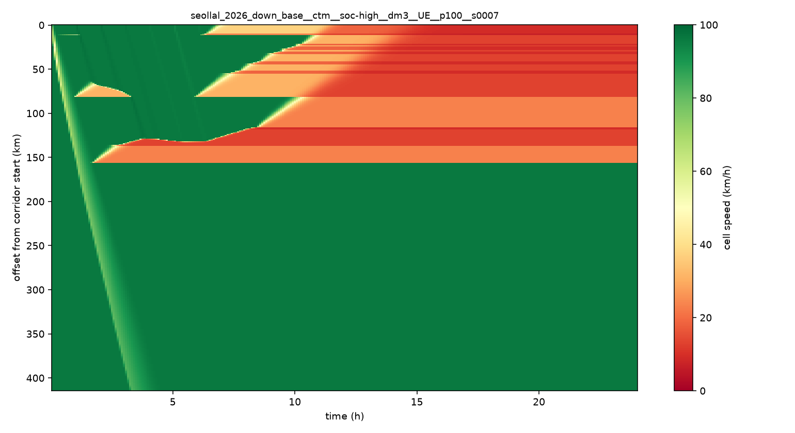

# CTM — 셀 전송 모형 (이슈 #56)

`src/evdt/world/ctm.py` · `world/ctm_run.py` · `world/travel.py` · `io/cells.py`
테스트: `tests/test_ctm.py` (21) · `tests/test_ctm_run.py` (13) · `tests/test_travel.py` (15)

```bash
python scripts/seed_cells.py --write        # 셀 (T-17)
python scripts/check_cells.py               # 0 ~ 415.058 km 를 덮는가
python scripts/plot_cell_state.py <run_id>  # 시공간 속도 지도
```

시나리오 config 에서 켠다.

```yaml
demand:
  travel_time: ctm     # fixed = 고정 속도(예전) · ctm = CTM 셀 속도
output:
  ctm_dt_min: 0.2
```

---

## 1. 왜 필요한가

지금까지 모든 차가 80 km/h 로 달렸다. 설 연휴의 핵심은 **도로가 막혀서 휴게소 도착이
늦어지고 몰리는 것**인데, 고정 속도로는 도착 시각이 틀리고 쏠림의 시간대가 어긋난다.
S2 이후의 도착 예측도 CTM 위에서 만든다.

## 2. 모형 — 한 줄이 전부다

셀 하나의 상태는 **"그 안에 몇 대 있는가"** `n` 하나뿐이다. 셀 사이 유량은

```
y = min(앞 셀이 보낼 수 있는 양, 뒤 셀이 받을 수 있는 양)
    보낼 수 있는 양 S = min(자유류로 흘러나올 몫, 용량)
    받을 수 있는 양 R = min(용량, 빈자리가 비워지는 속도)
```

정체는 따로 만들지 않는다. 뒤 셀이 꽉 차 `R` 이 0 이 되면 앞 셀이 못 보내고, 그게
다시 그 앞을 막는다. **정체가 상류로 번지는 것이 이 두 줄에서 저절로 나온다.**

### 돌기 전에 막는 것 두 가지

**삼각형 기본도** (설계문서 §9.5). `q_max` 는 독립 파라미터가 **아니다.**

```
q_max = v_free × w_back × k_jam / (v_free + w_back)
```

어기면 **정체가 아예 생기지 않는다.** `cell` 테이블에 CHECK 가 있고 `CellArrays` 가
다시 검사한다. 두 군데서 막는 이유는 셀이 DB 를 거치지 않고 만들어지는 경로
(테스트·합성 셀)가 있기 때문이다. 실제 DB 의 396개 셀이 이 검사를 통과한다는 것은
`seed_cells.py` 와 `ctm.py` 가 **서로 독립으로 계산한 값이 맞았다**는 뜻이다.

**CFL 조건.** `max(v_free, w_back) × dt ≤ 셀 길이`. 어기면 한 스텝에 차가 셀을
건너뛰고 정체파가 불가능한 속도로 퍼진다. 몇 번 셀이고 몇 개인지 말하고 멈춘다.

### 램프

셀 경계에서 처리한다.

- **진입 램프**는 본선과 뒤 셀의 빈자리를 나눠 쓴다 (Daganzo 병합). 막혀도 우선순위
  몫은 받는다.
- **진출 램프는 FIFO** — 본선이 막히면 나갈 차도 같이 막힌다. 한 줄에 서 있으니
  "나는 나갈 거니까" 로 앞질러 갈 수 없다. 이 가정 때문에 램프 근처 정체가 실제보다
  조금 세게 나올 수 있다 (#57 보정에서 볼 것).

> **구현 중 잡은 버그.** Daganzo 병합 공식(세 값의 중앙값)을 조건 없이 쓰면 **안
> 막혔을 때 수요보다 많이 흘려보낸다.** 수요 13, 공급 33, 우선순위 0.5 면 중앙값이
> 16.7 이다. 그러면 앞 셀이 내보낸 것보다 뒤 셀이 더 받아 차가 저절로 생긴다. 중앙값은
> **막혔을 때만** 맞는 식이라 조건을 붙였다. 차량 보존 테스트가 잡아냈다.

## 3. 검증

| 무엇 | 결과 |
|---|---|
| 차량 보존 (매 스텝, 램프·정체 섞어서) | 오차 0 |
| 어떤 셀도 정체 밀도 초과·음수 안 됨 | 통과 |
| **충격파가 해석해와 맞는가** | 해석해 −16.28 km/h · 실측 **−16.37** (오차 0.5%) |
| 병목 용량 아래면 정체 없음 (대조군) | 통과 |
| 자유류에서 셀 속도 = v_free | 통과 |
| 하행 규모(396셀) 하루(7,200스텝) | **2.1초** (완료조건 1분) |

충격파는 Rankine-Hugoniot 으로 값이 정해진다.

```
w_shock = (q_하류 − q_상류) / (k_하류 − k_상류)
```

삼각형 기본도에서 정체 구간 밀도가 용량으로 정해지므로, **정체가 번지는 속도도 숫자로
정해진다.** 모형이 그 숫자를 내는지가 CTM 이 맞는지의 판정이다.

## 4. 통행시간 — UE 와 잇는 자리

`world/travel.py` 가 두 구현을 같은 인터페이스 뒤에 둔다.

| | |
|---|---|
| `ConstantSpeed` | 고정 속도. 출발 시각과 무관 (옛 실험 재현) |
| `CellSpeedField` | CTM 이 낸 (시간칸 × 셀) 속도 격자 |

`engine/ue.py` 는 둘을 구분하지 않는다. 그래야 **"CTM 을 켠 것 말고는 모두 같다"** 는
비교가 된다. 출발 시각을 같이 넘기므로 **가는 도중에 막히기 시작하면 그걸 겪는다.**

**캐시.** UE 는 통행시간을 수만 번 묻는다. 물을 때마다 396개 셀을 걸으면 파이썬에서
수억 번이 된다. 그런데 **출발 지점은 언제나 셀 경계**다 — 휴게소는 반드시 셀 경계이고
(T-17 규칙 2) 코리도 진입점도 경계다. 그래서 (출발 경계, 출발 시간칸) 마다 하류 모든
경계까지의 누적 시간을 한 번만 계산하면 그 뒤로는 뺄셈이다.

**막힌 셀.** 속도 0 이면 통행시간이 무한이 된다. 완전 정지는 "한 칸이 꽉 찼다" 는
뜻이지 "영원히 못 간다" 가 아니므로 하한 1 km/h 를 둔다. 하한에 걸린 비율을
`ctm_jammed_share` KPI 로 남긴다 — **높으면 그 실행의 통행시간을 믿으면 안 된다.**

## 5. 기록 — `cell_state` 와 시공간 속도 지도

5분마다 셀마다 한 행. dt 0.2분 · 396셀이면 스텝마다 남길 때 285만 행인데 5분이면
11만 행이고, 대기 히트맵(5분 칸)과 가로축이 맞는다. 집계는 **평균**이다 — 5분 중 한
스텝만 막힌 것과 내내 막힌 것이 달라야 한다. 마지막 값만 쓰면 둘이 같아 보인다.

속도 격자와 `cell_state` 는 **같은 집계**에서 나온다. 다르면 "이 차가 왜 이때
도착했나" 를 기록으로 따라갈 수 없다.

스냅샷은 `entity_type="cell"` 로 네 지표(`speed_kmh` · `density_veh_km` ·
`flow_veh_h` · `ev_count`). 셀은 선분이라 점 하나로 줄여야 해서 **시작점** 좌표를 쓴다
— 끝점을 쓰면 이웃 셀과 겹쳐 보인다.

### 시공간 속도 지도 읽는 법



교통공학에서 가장 많이 쓰는 그림이다. **가로 시간 · 세로 위치 · 색 속도.**

- **세로축은 뒤집혀 있다.** 위가 양재IC(0 km), 아래가 구서IC(415 km). 하행이니
  **차는 위에서 아래로** 움직인다. 지도처럼 서울이 위다
- **차 한 대는 이 그림 위에서 선이고, 기울기가 속도다.** 가파르면 빠르고, 누우면
  느리다. 초반에 왼쪽 위에서 오른쪽 아래로 뻗은 연한 띠가 텅 빈 도로를 처음 훑고
  간 차들의 자국이다
- **정체는 색 덩어리다. 덩어리 위쪽 경계의 기울기가 충격파 속도다.** 왼쪽 위로
  뻗으면 상류로 번지는 것이다
- **병목은 정체가 시작된 자리가 아니라 정체가 끝나는 자리다.** 이게 가장 헷갈린다.
  색이 칠해진 구간이 "막힌 곳"이고 병목은 그 **아래 끝**이다. 덩어리의 아래 끝이
  시간이 지나도 움직이지 않으면 그 자리가 병목이다. 통과한 뒤는 오히려 뻥 뚫린다 —
  병목이 용량만큼만 흘려보내기 때문이다

위 그림에서 아래 끝이 **157.6 km 에 고정**되어 있다. 편도 3차로가 2차로로 줄어드는
지점(옥천IC 부근)이고, 차로 프로파일이 잡아낸 진짜 병목이다.

## 6. 고정 속도와 무엇이 달라지나

같은 코드·같은 시드·같은 수요 (하행 · 출발 SoC 높음 · 수요 ×3 · seed 7).
진입 EV 25,086 · 충전 필요 6,711 · 충전 정차 8,770 — **수요는 완전히 같고 통행시간만
다르다.**

| KPI | 고정 80 km/h | CTM | 배 |
|---|---:|---:|---:|
| 평균 대기 (분) | 123.7 | **38.2** | 0.31 |
| P95 대기 (분) | 401.6 | **208.2** | 0.52 |
| 최악 휴게소 평균 대기 (분) | 195.6 | **96.5** | 0.49 |
| 병목 슬롯 (칸) | 243 | **115** | 0.47 |
| **몰림비** | 1.448 | **1.655** | **1.14** |

**대기는 줄고 쏠림은 세졌다.** 처음 보면 이상하다 — 막히는데 왜 덜 기다리나?

정체가 **도착을 시간적으로 흩뿌리기** 때문이다. 고정 속도에서는 같이 출발한 차가 같이
도착해 충전기 앞에 한꺼번에 쌓인다. 막히면 차마다 지연이 달라 도착이 퍼진다. 숫자로
확인했다.

| | 고정 80 | CTM |
|---|---:|---:|
| 5분 칸당 최대 도착 (대) | 57 | **42** |
| 칸당 도착 수 표준편차 | 14.5 | **9.9** |
| 최다 휴게소 도착 시각 IQR (분) | 661 | **870** |
| 최다 휴게소 도착 대수 | 1,038 | **1,124** |

같은 8,770번의 도착이 **더 넓은 시간에 퍼졌다.** 그 휴게소를 고른 차는 오히려 늘었는데
(1,038 → 1,124, 몰림비 ↑) 대기는 줄었다. 큐는 "몇 대가 오나" 만큼 "얼마나 몰려서
오나" 로 정해진다는 것이 그대로 보인다.

## 7. ⚠ 지금 결과를 재현으로 읽으면 안 되는 이유

배경 교통이 **전부 코리도 시작점으로 들어와 끝까지 간다.** 실제로는 대부분 중간 IC 에서
빠진다. 그래서

- CTM 진입 147,412대 중 **60,991대가 하루 끝에 도로에 남아 있다**
- 뒤쪽 구간 정체가 과장되고, 그 과장된 정체가 도착을 실제보다 더 흩뿌린다

실측을 보면 그 구간(옥천~영동) 시간교통량 최대가 2,640 대/h 로 2차로 용량 4,394 대/h
의 절반이다 — 실제로는 거기까지 오는 차가 그만큼 없다는 뜻이다.

| 남은 것 | 티켓 |
|---|---|
| 중간 진출입 (램프 유입·유출을 OD 로 채운다) | #54 · #63 |
| 파라미터 보정 (실측 속도·교통량에 맞춘다) | #57 |
| 검증 (보정에 안 쓴 날로. 위 그림을 실측과 나란히) | #58 |

그때까지 `travel_time: ctm` 은 **"CTM 을 얹으면 무엇이 달라지나" 를 보는 장치**지
2026 설 연휴의 재현이 아니다. 기본값이 `fixed` 인 이유다.
