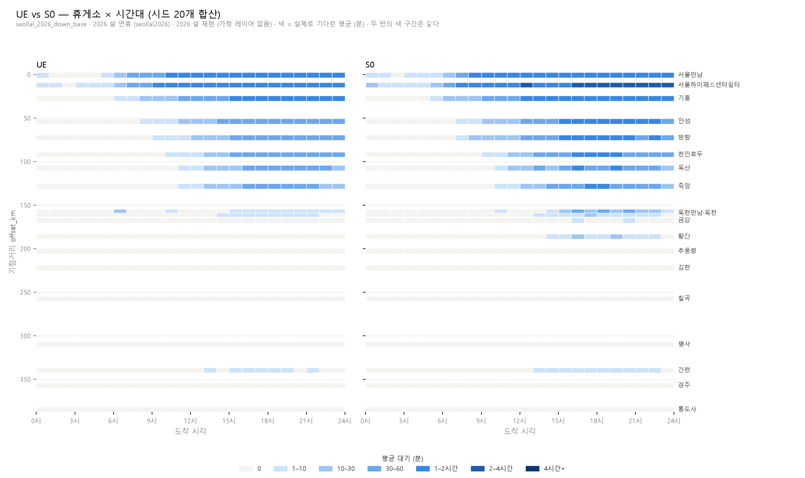

# S0 — 앱 화면만 보고 고르는 운전자 (이슈 #59)

사다리의 첫 칸. **"정보를 주는 것만으로는 쏠림이 안 풀린다"** 를 숫자와 그림으로 보이는 자리다.

```bash
python scripts/run_experiment.py --seeds 1-20                # UE (무대)
python scripts/run_experiment.py --seeds 1-20 --stage S0     # 같은 무대, 다른 운전자
python scripts/compare_stages.py --seeds 1-20                # 나란히 놓고 본다
python scripts/plot_station_wait.py <S0 run_id> --vs <UE run_id> --top 3
```

---

## 1. UE 와 정확히 무엇이 다른가

**하나뿐이다.**

| | UE | S0 |
|---|---|---|
| 운전자가 아는 것 | **도착했을 때의** 대기 | **지금 화면에 뜬** 대기 |
| 어떤 사람인가 | 명절마다 같은 길을 다니며 "안성은 9시에 막힌다" 를 아는 사람 | 출발할 때 앱을 한 번 보는 사람 |
| 어떻게 푸는가 | 하루를 미리 다 풀어 균형(Wardrop)을 찾는다 | Δt 마다 한 번씩 물어보고 그 자리에서 답한다 |

나머지는 **한 글자도 다르지 않다.** 같은 차량 집합(같은 시드·진입 시각·진입 지점·
출발 SoC·목적지), 같은 휴게소와 충전기, 같은 통행시간, 같은 기온 계수, 같은 충전량
규칙, 같은 큐 규칙(FIFO · 유휴 중 최고출력), 같은 이탈 비용.

> 이게 지켜지는지는 `tests/test_experiment.py::test_ue_and_s0_get_the_same_cars` 와
> `scripts/compare_stages.py` 의 `check_same_world` 가 매번 확인한다. 수요가 다르면
> 비교표를 아예 만들지 않는다 — **다른 세계의 차이를 정책의 성과로 적는 것**이
> 이 프로젝트에서 가장 하기 쉬운 실수다.

### 근시안은 **한 가지**여야 한다

S0 는 **제 충전시간은 정확히 안다.** 큐가 쓰는 `charge_time_min` 을 그대로 부른다
(충전 곡선까지 포함해서). 전력으로 어림하게 두면 S0 의 근시안이 두 가지
("줄을 모른다" + "제 충전시간도 모른다")로 섞여서, 나중에 S0 가 진 이유를 못 가른다.

---

## 2. Δt 루프 — 시뮬레이터는 어느 단계가 도는지 모른다

`src/evdt/world/corridor_sim.py`. 한 스텝에서 하는 일, **순서가 곧 모델**이다.

```
0. horizon 안이면 스냅샷을 찍는다 (t 까지)
1. 결정 시점이 [t, t+Δt) 인 차를 모은다      ← 진입할 때 / 충전이 끝날 때
2. 시각 t 의 화면을 만들어 보여주고 물어본다   ← Policy.decide(evs, world)
3. 대답대로 보낸다                           ← 도착 시각은 차의 실제 결정 시각에서 잰다
4. [t, t+Δt) 에 휴게소에 닿은 차를 큐에 넣는다
```

`decide` 가 돌려줄 수 있는 답은 넷이다.

| 답 | 뜻 |
|---|---|
| 휴게소 ID | 그리로 간다 |
| `NO_CHARGE` | 충전하지 않고 목적지까지 간다 |
| `ESCAPE_BALKED` (+ 남았다면 갔을 휴게소) | 줄이 이탈보다 비싸서 나간다 — **엔진이 고칠 수 있는 이탈** |
| `ESCAPE_NO_PLAN` | 닿는 휴게소가 아예 없어서 나간다 (§3.1 도 볼 것 — 이 중 일부는 정책 탓이다) |
| (빠짐) | "이번 Δt 에는 못 정했다" — 다음 Δt 에 다시 묻는다 |

**충전이 필요한가 / 줄이 너무 긴가 하는 판단은 전부 정책의 몫이다.** 시뮬레이터가
하면 스테이지 비교가 의미를 잃는다 (설계 규칙 2). 반대로 **얼마나 채우는가는 정책의
몫이 아니다** — 설계문서 §2.3 이 목표 SoC 를 결정변수에서 뺐다. 그래서 `ChargeAmount`
가 UE 와 같은 함수로 계산한다.

### 정보의 나이 — 이 모델의 유일한 근사

시각 t 의 화면은 t 까지 도착한 차만 반영한다. 결정 시점이 `[t, t+Δt)` 에 있는 차는
**t 의 화면**을 본다 — 즉 최대 Δt 만큼 낡은 정보다. 이게 실제 앱이고, 쏠림을
만드는 것도 이 낡음이다.

**물리는 근사하지 않는다.** 주행시간은 차가 실제로 결정한 시각과 위치에서 UE 와
같은 `TravelTime` 객체로 잰다. Δt 를 키운다고 차가 공짜로 빨라지지 않는다
(`test_the_drive_is_timed_from_the_cars_own_moment_not_the_grid`).

### 큐는 한 곳에서만 돈다

`world/sim.py` 의 `StationQueue` 를 DES 와 Δt 루프가 **같이 쓴다.** 둘이 각자
`queue_rule` 을 부르면 "같은 세계" 라는 전제가 조용히 깨진다. 그래서 `corridor_sim`
은 `queue_rule` 을 직접 임포트하지 않고 `world/sim.py` 를 거친다
(`test_queue_rule_has_at_most_two_callers`).

---

## 3. 결과 — 같은 세계, 정보만 다르게 (하행 · **시드 20개 · 95% 신뢰구간**)

```bash
python scripts/compare_stages.py --seeds 1-20
```

| 지표 | UE | S0 | 변화 |
|---|---:|---:|---:|
| **평균 대기 (분)** | 20.5 [19.6, 21.4] | **28.8 [28.1, 29.6]** | **+40.8%** |
| P95 대기 (분) | 74.3 [72.9, 75.6] | 95.8 [94.4, 97.2] | +29.0% |
| **최대 대기 (분)** | 105.6 [103.8, 107.3] | **268.4 [241.3, 295.6]** | **+154.3%** |
| 최악 휴게소 평균 대기 (분) | 62.1 [60.7, 63.4] | 97.4 [92.3, 102.5] | +56.9% |
| 총 체류 (시간) | 4,774 [4,628, 4,920] | 6,109 [5,986, 6,233] | +28.0% |
| 병목 슬롯 (칸) | 89.3 [85.5, 93.1] | 99.6 [96.9, 102.3] | +11.5% |
| 이탈 합계 (대) | 1,141 [1,121, 1,160] | 1,239 [1,216, 1,262] | +8.6% |
| 이탈: 줄이 길어서 (대) | 113.0 [103.4, 122.5] | 142.1 [127.8, 156.3] | +25.8% |
| **이탈: 정책이 몰아넣음 (대)** | **0.0 [0.0, 0.0]** | **70.4 [65.3, 75.5]** | **+70.4대** |
| 몰림비 | 2.1 [2.1, 2.1] | 2.1 [2.1, 2.1] | **구간 겹침** |

**수요 지표(진입 EV · 충전 필요 · 출발 SoC 평균)는 시드마다 소수점까지 같다.**
다르면 `compare_stages.py` 가 비교표를 아예 만들지 않는다.

> **구간이 겹치면 차이를 주장하지 않는다.** 몰림비가 그 예다 — 대기는 크게
> 나빠졌는데 "수요몫÷충전기몫" 은 안 움직였다. **쏠림을 몫으로만 재면 못 잡는다.**

**UE 의 `n_escaped_stranded` 가 시드 20개에서 전부 0.0 이다.** 우연이 아니라
원리다 (§3.1).



히트맵에서 두 가지가 보인다.

1. **앞쪽이 더 짙어진다.** 서울하이패스센터쉼터가 S0 에서 2~4시간·4시간+ 칸까지 간다
2. **혼잡이 뒤로 번진다.** UE 에서는 거의 비어 있던 옥천·황간·금강이 S0 에서 물든다 —
   앞에서 밀린 차가 뒤로 떠밀린 것이다

그러면서도 **칠곡·평사·통도사는 양쪽 다 비어 있다.** 거기는 배정의 문제가 아니라
충전기 간격의 문제다 (`docs/charger_gaps.md`). 엔진이 손댈 자리와 아닌 자리가
한 그림에 같이 있다.

---

## 3.1 S0 는 줄만 망치는 게 아니라 **경로도** 망친다

처음에는 "`no_plan` 은 충전기 공백 탓이니 정책과 무관하게 같겠지" 라고 봤다.
1,025 → 1,102 로 77대가 늘어서 들여다봤더니 그렇지 않았다.

**한 번 충전하고 나서 "닿는 곳이 없다" 로 나간 차**를 세어 보면

| (시드 20개 평균) | UE | S0 |
|---|---:|---:|
| `no_plan` 이탈 | 1,028 | 1,097 |
| **그중 이미 충전한 적이 있는 차** | **0.0** | **70.4** |

**UE 에서는 원리상 0 이다.** 계획을 통째로 세우므로, 갈 수 있는 계획이 있으면 그
계획으로 간다. S0 에서는 **가까운 곳에 먼저 서 버리는 바람에** 그 다음에 닿는 곳이
없어진다. 다른 곳에 섰으면 갈 수 있었던 차들이다.

> **그러므로 이 80대는 `no_plan` 칸에 있지만 충전기 공백의 책임이 아니라 배정의
> 책임이다.** 안 가르면 엔진이 고쳐야 할 과녁을 그만큼 작게 잡게 된다
> (#54 에서 balked/no_plan 을 가른 것과 같은 이유). KPI `n_escaped_stranded` 로 남고,
> `tests/test_experiment.py::test_ue_never_strands_a_car_after_it_has_charged` 가
> UE 쪽이 0 인지 지킨다.

**배정의 과녁 = balked + stranded.** 시드 20개에서 **UE 113대 → S0 213대.**
정보를 줬는데 오히려 두 배 가까이 밀어냈다.

같은 현상이 정차 횟수에도 나온다 (seed 7): 3회 서야 했던 차가 UE 3대 → **S0 132대**.
가까운 곳에서 조금씩 채우니 자꾸 다시 서게 된다.

---

## 4. 왜 안 통하는가 — 도착이 뭉친다

`docs/figures/s0_station_wait.png`

대기시간만 보면 "S0 가 더 오래 기다린다" 로 끝난다. 원인은 **도착 패턴**에 있다.

**도착 뭉침 지수 = 5분당 도착 대수의 분산 ÷ 평균.** 1.0 이면 무작위 도착(포아송)이고,
2 면 같은 대수가 두 배로 뭉쳐 온다.

| 휴게소 | km | 대수 | 평균 대기 UE → S0 | **도착 뭉침 UE → S0** |
|---|---:|---:|---|---|
| 망향 | 73 | 840 | 23.4 → 36.6분 | **1.68 → 3.25** |
| 안성 | 54 | 1,476 | 23.6 → 34.7분 | **1.20 → 2.27** |
| 기흥 | 27 | 1,055 | 42.6 → 56.4분 | 1.04 → 2.06 |
| 서울하이패스 | 12 | 106 | 69.6 → 85.4분 | 0.99 → 2.09 |
| 추풍령 | 203 | 219 | 0.0 → 0.0분 | 2.12 → 2.05 |
| 평사 | 310 | 373 | 0.0 → 0.0분 | 1.35 → 1.24 |

**UE 의 도착은 무작위에 가깝고(≈1.0), S0 의 도착은 두세 배로 뭉친다.** 같은 화면을
본 무리가 함께 출발해 함께 도착한다.

그리고 **줄이 비어 있는 뒤쪽(추풍령·평사 이후)에서는 두 값이 거의 같다.** 몰릴
이유가 없으면 안 몰린다 — 뭉침이 모델의 인공물이 아니라 **혼잡에 대한 반응**이라는
뜻이다.

대기 시계열을 보면 톱니가 보인다: 몰림 → 화면이 빨개짐 → 다음 무리는 딴 데로 →
여기가 비고 저기가 막힘. **UE 에는 이 진동이 원리상 없다.**

---

## 5. 열린 것 · 다음 칸

- **S0 는 사실상 "가장 가까운 휴게소"** 다 (설계문서 §6.2 표에 적힌 그대로). 모두의
  화면이 비어 있는 새벽에는 `대기 0 + 충전시간` 이 최소인 곳 = 덜 채워도 되는 가까운
  곳이기 때문이다. 이게 앞쪽 휴게소가 막히고 뒤쪽이 비는 이유다
- **Δt = 5분**은 `time.dt_min` 이다. 화면 갱신 주기이자 정보의 나이 상한이다.
  실제 앱이 얼마나 자주 갱신되는지는 #64 의 조사 대상이다
- **`demand.charge_prob` 는 여전히 죽은 값이다.** config 주석은 "S0 가 쓰게 되면
  살아난다" 고 적혀 있었는데, **S0 도 쓰지 않는다.** 확률로 충전 여부를 뽑으면
  UE 와 S0 가 **다른 차량 집합**을 상대하게 되어 비교가 성립하지 않는다.
  충전 여부는 수요를 만들 때 한 번만 정한다 (`build_trip_demands`)
- **다음 칸은 S1** — 예약 원장. S0 가 진 이유가 "남들이 어디로 가는지 모른다" 이므로,
  원장이 그 정보를 준다
